.. _quick_start:

Quick-Start Installation and Tutorial
=====================================

Zuul is not like other CI or CD systems.  It is a project gating
system designed to assist developers in taking a change from proposal
through deployment.  Zuul can support any number of workflow processes
and systems, but to help you get started with Zuul, this tutorial will
walk through setting up a basic gating configuration which protects
projects from merging broken code.

This tutorial is entirely self-contained and may safely be run on a
workstation.  The only requirements are a network connection and the
ability to run Docker containers.

This tutorial supplies a working Gerrit for code review, though the
concepts you will learn apply equally to GitHub.

.. note:: Even if you don't ultimately intend to use Gerrit, you are
	  encouraged to follow this tutorial to learn how to set up
	  and use Zuul.

At the end of the tutorial, you will find further information about
how to configure your Zuul to interact with GitHub.

Start Zuul Containers
---------------------

Before you start, ensure that some needed packages are installed.

.. code-block:: shell

   # Red Hat / Fedora / CentOS:

   sudo yum install docker docker-compose git git-review

   # OpenSuse:

   sudo zypper install docker docker-compose git git-review

   # Ubuntu / Debian:

   sudo apt-get install docker-compose git git-review

   # Start and Enable the docker service on Fedora / CentOS
   # Red Hat / OpenSuse:

   sudo systemctl enable docker.service
   sudo systemctl start docker.service

Clone the Zuul repository:

.. code-block:: shell

   git clone https://git.zuul-ci.org/zuul

Then cd into the directory containing this document, and run
docker-compose in order to start Zuul, Nodepool and Gerrit.

.. code-block:: shell

   cd zuul/doc/source/admin/examples
   sudo -E docker-compose up

For reference, the files in that directory are also `browsable on the web
<http://git.zuul-ci.org/cgit/zuul/tree/doc/source/admin/examples>`_.

All of the services will be started with debug-level logging sent to
the standard output of the terminal where docker-compose is running.
You will see a considerable amount of information scroll by, including
some errors.  Zuul will immediately attempt to connect to Gerrit and
begin processing, even before Gerrit has fully initialized.  The
docker composition includes scripts to configure Gerrit and create an
account for Zuul.  Once this has all completed, the system should
automatically connect, stabilize and become idle.  When this is
complete, you will have the following services running:

* Zookeeper
* Gerrit
* Nodepool Launcher
* Zuul Scheduler
* Zuul Web Server
* Zuul Executor
* Apache HTTPD

And a long-running static test node used by Nodepool and Zuul upon
which to run tests.

The Zuul scheduler is configured to connect to Gerrit via a connection
named ``gerrit``.  Zuul can interact with as many systems as
necessary, each such connection is assigned a name for use in the Zuul
configuration.

Zuul is a multi-tenant application, so that differing needs of
independent work-groups can be supported from one system.  This
example configures a single tenant named ``example-tenant``.  Assigned
to this tenant are three projects: ``zuul-config``, ``test1`` and
``test2``.  These have already been created in Gerrit and are ready
for us to begin using.

Add Your Gerrit Account
-----------------------

Before you can interact with Gerrit, you will need to create an
account.  The initialization script has already created an account for
Zuul, but has left the task of creating your own account to you so
that you can provide your own SSH key.  You may safely use any
existing SSH key on your workstation, or you may create a new one by
running ``ssh-keygen``.

Gerrit is configured in a development mode where passwords are not
required in the web interface and you may become any user in the
system at any time.

To create your Gerrit account, visit http://localhost:8080 in your
browser and click `Sign in` in the top right corner.

Then click `New Account` under `Register`.

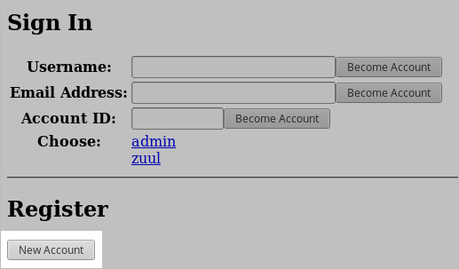

Don't bother to enter anything into the confirmation dialog that pops
up, instead, click the `settings` link at the bottom.

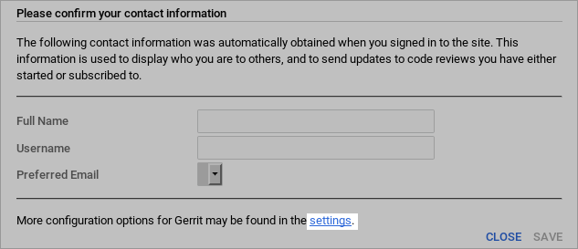

In the `Profile` section at the top, enter the username you use to log
into your workstation in the `Username` field and your full name in
the `Full name` field, then click `Save Changes`.

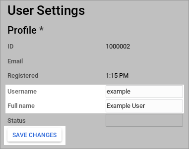

Scroll down to the `Email Addresses` section and enter your email
address into the `New email address` field, then click `Send
Verification`.  Since Gerrit is in developer mode, it will not
actually send any email, and the address will be automatically
confirmed.  This step is useful since several parts of the Gerrit user
interface expect to be able to display email addresses.

Scroll down to the `SSH keys` section and copy and paste the contents
of ``~/.ssh/id_rsa.pub`` into the `New SSH key` field and click `Add
New SSH Key`.

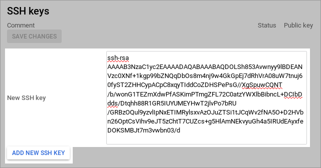

.. We ask them to click reload so that the page refreshes and their
   avatar appears in the top right.  Otherwise it's difficult to see
   that there's anything there to click.

Click the `Reload` button in your browser to reload the page with the
new settings in effect.  At this point you have created and logged
into your personal account in Gerrit and are ready to begin
configuring Zuul.

Configure Zuul Pipelines
------------------------

Zuul recognizes two types of projects: :term:`config
projects<config-project>` and :term:`untrusted
projects<untrusted-project>`.  An *untrusted project* is a normal
project from Zuul's point of view.  In a gating system, it contains
the software under development and/or most of the job content that
Zuul will run.  A *config project* is a special project that contains
the Zuul's configuration.  Because it has access to normally
restricted features in Zuul, changes to this repository are not
dynamically evaluated by Zuul.  The security and functionality of the
rest of the system depends on this repository, so it is best to limit
what is contained within it to the minimum, and ensure thorough code
review practices when changes are made.

Zuul has no built-in workflow definitions, so in order for it to do
anything, you will need to begin by making changes to a *config
project*.  The initialization script has already created a project
named ``zuul-config`` which you should now clone onto your workstation:

.. code-block:: shell

  git clone http://localhost:8080/zuul-config

You will find that this repository is empty.  Zuul reads its
configuration from either a single file or a directory.  In a *Config
Project* with substantial Zuul configuration, you may find it easiest
to use the ``zuul.d`` directory for Zuul configuration.  Later, in
*Untrusted Projects* you will use a single file for in-repo
configuration.  Make the directory:

.. code-block:: shell

   cd zuul-config
   mkdir zuul.d

The first type of configuration items we need to add are the Pipelines
we intend to use.  In Zuul, a Pipeline represents a workflow action.
It is triggered by some action on a connection.  Projects are able to
attach jobs to run in that pipeline, and when they complete, the
results are reported along with actions which may trigger further
Pipelines.  In a gating system two pipelines are required:
:term:`check` and :term:`gate`.  In our system, ``check`` will be
triggered when a patch is uploaded to Gerrit, so that we are able to
immediately run tests and report whether the change works and is
therefore able to merge.  The ``gate`` pipeline is triggered when a code
reviewer approves the change in Gerrit.  It will run test jobs again
(in case other changes have merged since the change in question was
uploaded) and if these final tests pass, will automatically merge the
change.  To configure these pipelines, copy the following file into
`zuul.d/pipelines.yaml`:

.. literalinclude:: examples/zuul-config/zuul.d/pipelines.yaml
   :language: yaml

Once we have bootstrapped our initial Zuul configuration, we will want
to use the gating process on this repository too, so we need to attach
the ``zuul-config`` repository to the ``check`` and ``gate`` pipelines
we are about to create.  There are no jobs defined yet, so we must use
the internally defined ``noop`` job, which always returns success.
Later on we will be configuring some other projects, and while we will
be able to dynamically add jobs to their pipelines, those projects
must first be attached to the pipelines in order for that to work.  In
our system, we want all of the projects in Gerrit to participate in
the check and gate pipelines, so we can use a regular expression to
apply this to all projects.  To configure the ``check`` and ``gate``
pipelines for ``zuul-config`` to run the ``noop`` job, and add all
projects to those pipelines (with no jobs), copy the following file
into ``zuul.d/projects.yaml``:

.. literalinclude:: examples/zuul-config/zuul.d/projects.yaml
   :language: yaml

Every real job (i.e., all jobs other than ``noop``) must inherit from a
:term:`base job`, and base jobs may only be defined in a
:term:`config-project`.  Let's go ahead and add a simple base job that
we can build on later.  Copy the following into ``zuul.d/jobs.yaml``:

.. literalinclude:: examples/zuul-config/zuul.d/jobs.yaml
   :language: yaml

Commit the changes and push them up for review:

.. code-block:: shell

   git add zuul.d
   git commit -m "Add initial Zuul configuration"
   git review

Because Zuul is currently running with no configuration whatsoever, it
will ignore this change.  For this initial change which bootstraps the
entire system, we will need to bypass code review (hopefully for the
last time).  To do this, you need to switch to the Administrator
account in Gerrit.  Visit http://localhost:8080 in your browser and
then:

Click the avatar image in the top right corner then click `Sign out`.

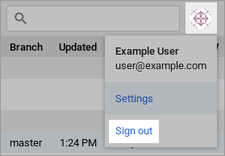

Then click the `Sign in` link again.

Click `admin` to log in as the `admin` user.

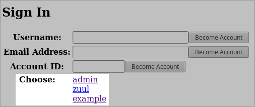

You will then see a list of open changes; click on the change you
uploaded.

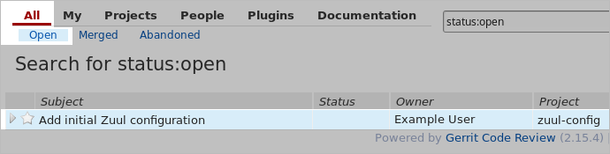

Click `Reply...` at the top center of the change screen.  This will
open a dialog where you can leave a review message and vote on the
change.  As the administrator, you have access to vote in all of the
review categories, even `Verified` which is normally reserved for
Zuul.  Vote Code-Review: +2, Verified: +2, Workflow: +1, and then
click `Send` to leave your approval votes.

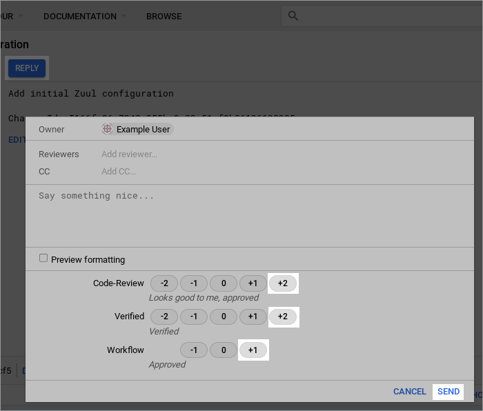

Once the required votes have been set, the `Submit` button will appear
in the top right; click it.  This will cause the change to be merged
immediately.  This is normally handled by Zuul, but as the
administrator you can bypass Zuul to forcibly merge a change.

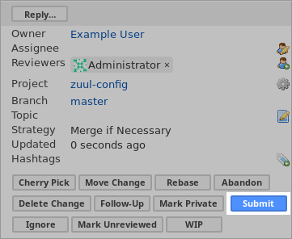

Now that the initial configuration has been bootstrapped, you should
not need to bypass testing and code review again, so switch back to
the account you created for yourself.  Click on the avatar image in
the top right corner then click `Sign out`.

.. image:: images/sign-out-admin.png
   :align: center

Then click the `Sign in` link again.

And click your username to log into your account.

Test Zuul Pipelines
-------------------

Zuul is now running with a basic :term:`check` and :term:`gate`
configuration.  Now is a good time to take a look at Zuul's web
interface.  Visit http://localhost:9000/t/example-tenant/status to see
the current status of the system.  It should be idle, but if you leave
this page open during the following steps, you will see it update
automatically.

We can now begin adding Zuul configuration to one of our
:term:`untrusted projects<untrusted-project>`.  Start by cloning the
`test1` project which was created by the setup script.

.. code-block:: shell

   cd ..
   git clone http://localhost:8080/test1

Every Zuul job that runs needs a playbook, so let's create a
sub-directory in the project to hold playbooks:

.. code-block:: shell

   cd test1
   mkdir playbooks

Start with a simple playbook which just outputs a debug message.  Copy
the following to ``playbooks/testjob.yaml``:

.. literalinclude:: examples/test1/playbooks/testjob.yaml
   :language: yaml

Now define a Zuul job which runs that playbook.  Zuul will read its
configuration from any of ``zuul.d/`` or ``.zuul.d/`` directories, or
the files ``zuul.yaml`` or ``.zuul.yaml``.  Generally in an *untrusted
project* which isn't dedicated entirely to Zuul, it's best to put
Zuul's configuration in a hidden file.  Copy the following to
``.zuul.yaml`` in the root of the project:

.. literalinclude:: examples/test1/zuul.yaml
   :language: yaml

Commit the changes and push them up to Gerrit for review:

.. code-block:: shell

   git add .zuul.yaml playbooks
   git commit -m "Add test Zuul job"
   git review

Zuul will dynamically evaluate proposed changes to its configuration
in *untrusted projects* immediately, so shortly after your change is
uploaded, Zuul will run the new job and report back on the change.

Visit http://localhost:8080/dashboard/self and open the change you
just uploaded.  If the build is complete, Zuul should have left a
Verified: +1 vote on the change, along with a comment at the bottom.
Expand the comments and you should see that the job succeeded, but
there are no logs and no way to see the output, only a `finger` URL
(which is what Zuul reports when it doesn't know where build logs are
stored).

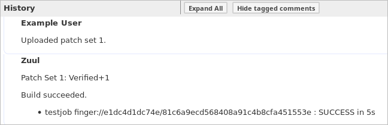

This means everything is working so far, but we need to configure a
bit more before we have a useful job.

Configure a Base Job
--------------------

Every Zuul tenant needs at least one base job.  Zuul administrators
can use a base job to customize Zuul to the local environment.  This
may include tasks which run both before jobs, such as setting up
package mirrors or networking configuration, or after jobs, such as
artifact and log storage.

Zuul doesn't take anything for granted, and even tasks such as copying
the git repos for the project being tested onto the remote node must
be explicitly added to a base job (and can therefore be customized as
needed).  The Zuul in this tutorial is pre-configured to use the `zuul
jobs`_ repository which is the "standard library" of Zuul jobs and
roles.  We will make use of it to quickly create a base job which
performs the necessary set up actions and stores build logs.

.. _zuul jobs: https://zuul-ci.org/docs/zuul-jobs/

Return to the ``zuul-config`` repo that you were working in earlier.
We're going to add some playbooks to the empty base job we created
earlier.  Start by creating a directory to store those playbooks:

.. code-block:: shell

   cd ..
   cd zuul-config
   mkdir -p playbooks/base

Zuul supports running any number of playbooks before a job (called
*pre-run* playbooks) or after a job (called *post-run* playbooks).
We're going to add a single *pre-run* playbook now.  Copy the
following to ``playbooks/base/pre.yaml``:

.. literalinclude:: examples/zuul-config/playbooks/base/pre.yaml
   :language: yaml

This playbook does two things; first it creates a new SSH key and adds
it to all of the hosts in the inventory, and removes the private key
that Zuul normally uses to log into nodes from the running SSH agent.
This is just an extra bit of protection which ensures that if Zuul's
SSH key has access to any important systems, normal Zuul jobs can't
use it.  The second thing the playbook does is copy the git
repositories that Zuul has prepared (which may have one or more
changes being tested) to all of the nodes used in the job.

Next, add a *post-run* playbook to remove the per-build SSH key.  Copy
the following to ``playbooks/base/post-ssh.yaml``:

.. literalinclude:: examples/zuul-config/playbooks/base/post-ssh.yaml
   :language: yaml

This is the complement of the `add-build-sshkey` role in the pre-run
playbook -- it simply removes the per-build ssh key from any remote
systems.  Zuul always tries to run all of the post-run playbooks
regardless of whether any previous playbooks have failed.  Because we
always want log collection to run and we want it to run last, we
create a second post-run playbook for it.  Copy the following to
``playbooks/base/post-logs.yaml``:

.. literalinclude:: examples/zuul-config/playbooks/base/post-logs.yaml
   :language: yaml

This tutorial is running an Apache webserver in a container which will
serve build logs from a volume that is shared with the Zuul executor.
That volume is mounted at `/srv/static/logs`, which is the default
location in the `upload-logs`_ role.  The role also supports copying
files to a remote server via SCP; see the role documentation for how
to configure it.  For this simple case, the only option we need to
provide is the URL where the logs can ultimately be found.

.. note:: Zuul-jobs also contains a `role
          <https://zuul-ci.org/docs/zuul-jobs/roles.html#role-upload-logs-swift>`_
          to upload logs to an OpenStack Object Storage (swift)
          container.  If you create a role to upload logs to another
          system, please feel free to contribute it to the zuul-jobs
          repository for others to use.

.. _upload-logs: https://zuul-ci.org/docs/zuul-jobs/roles.html#role-upload-logs

Now that the new playbooks are in place, update the ``base`` job
definition to include them.  Overwrite ``zuul.d/jobs.yaml`` with the
following:

.. literalinclude:: examples/zuul-config/zuul.d/jobs2.yaml
   :language: yaml

Then commit the change and upload it to Gerrit for review:

.. code-block:: shell

   git add playbooks zuul.d/jobs.yaml
   git commit -m "Update Zuul base job"
   git review

Visit http://localhost:8080/dashboard/self and open the
``zuul-config`` change you just uploaded.

You should see a Verified +1 vote from Zuul.  Click `Reply` then vote
Code-Review: +2 and Workflow: +1 then click `Send`.

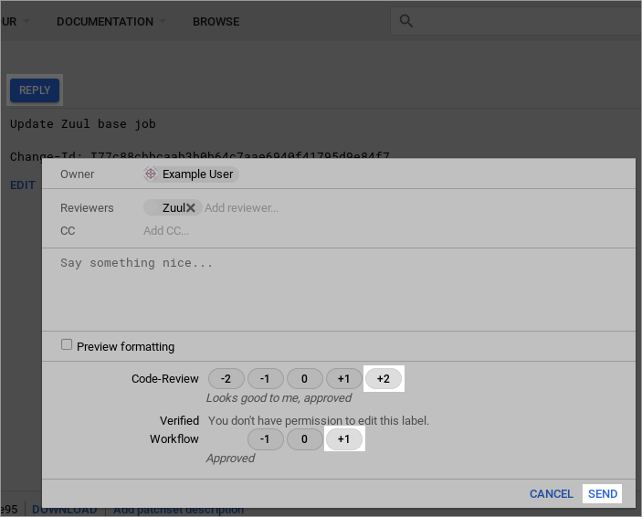

Wait a few moments for Zuul to process the event, and then reload the
page.  The change should have been merged.

Visit http://localhost:8080/dashboard/self and return to the
``test1`` change you uploaded earlier.  Click `Reply` then type
`recheck` into the text field and click `Send`.

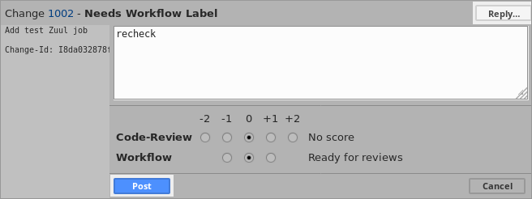

This will cause Zuul to re-run the test job we created earlier.  This
time it will run with the updated base job configuration, and when
complete, it will report the published log location as a comment on
the change:

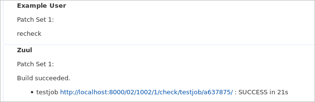

Follow the link and you will be able to browse the console log for the
job.  In the middle of the log, you should see the "Hello, world!"
output from the job's playbook.

Further Steps
-------------

If you would like to make further changes to Zuul, its configuration
files are located in the ``zuul/doc/source/admin/examples`` directory
and are bind-mounted into the running containers.  You may edit them
and restart the Zuul containers to make changes.

If you would like to connect your Zuul to GitHub, see
:ref:`github_driver`.

.. TODO: write an extension to this tutorial to connect to github
